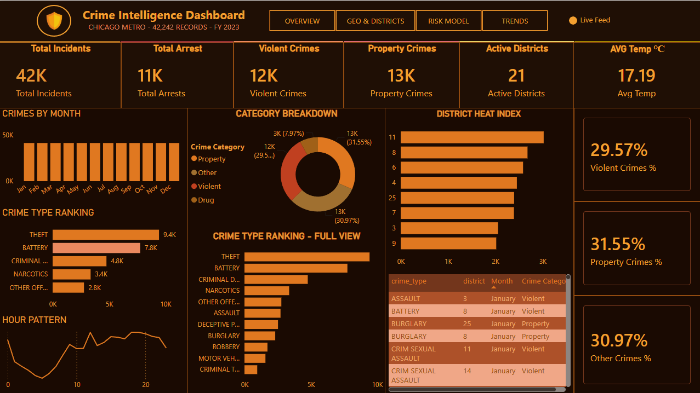
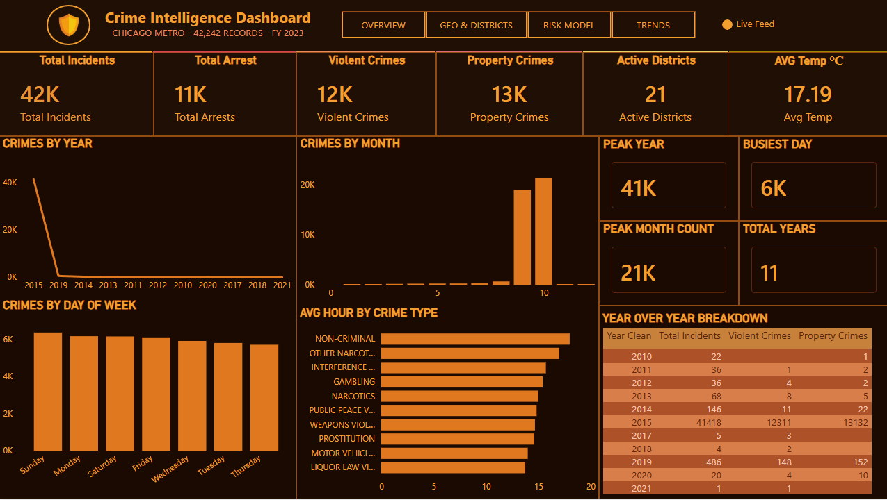

# 🏙️ Smart City Crime Analytics


> **Data Analytics Project** — An end-to-end crime analytics platform analyzing 7.8M+ records from Chicago and Los Angeles using Python, MySQL, Machine Learning, and Power BI.

---

## 📌 Project Overview

This project builds a complete data analytics pipeline for smart city crime analysis. It ingests raw crime data, cleans and transforms it using Python, stores it in a MySQL data warehouse, trains a Machine Learning model to predict crime risk, and visualizes everything in an interactive Power BI dashboard.

---

## 🎯 Key Features

- 📊 **7.8M+ crime records** analyzed from Chicago (2001–2026) and Los Angeles
- 🔄 **Automated ETL pipeline** in Python (pandas, SQLAlchemy)
- 🗄️ **MySQL data warehouse** with star schema design
- 🤖 **Random Forest ML model** with 69.16% accuracy predicting arrest risk
- 📈 **4-page interactive Power BI dashboard** with KPIs, maps, and trends
- 🌡️ **Weather data integration** — correlating temperature with crime rates
- 👥 **Census data enrichment** — crime rate per 1,000 residents

---

## 🛠️ Tech Stack

| Technology | Purpose |
|---|---|
| **Python 3.11** | Data cleaning, ETL pipeline, ML models |
| **Pandas & NumPy** | Data manipulation and analysis |
| **Scikit-learn** | Random Forest classification model |
| **SQLAlchemy & PyMySQL** | Database connectivity |
| **MySQL 8.0** | Data warehouse storage |
| **Power BI Desktop** | Interactive dashboard and visualization |
| **Jupyter Notebooks** | Exploratory data analysis |
| **Matplotlib & Seaborn** | Data visualization in Python |

---

## 📁 Project Structure

```
Smart_City_Crime_Analytics/
│
├── datasets/
│   ├── Crimes_-_2001_to_Present.csv      ← Chicago crime data
│   ├── chicago crimes.csv                 ← Chicago 2024-2026
│   ├── Crime_Data_from_2020_to_Present.csv ← LA crime data
│   ├── temperature.csv                    ← Weather data
│   ├── acs2017_census_tract_data.csv      ← Census data
│   ├── chicago_clean.csv                  ← Cleaned Chicago data
│   ├── la_clean.csv                       ← Cleaned LA data
│   ├── census_clean.csv                   ← Cleaned census data
│   └── chicago_with_predictions.csv       ← ML predictions output
│
├── Notebooks/
│   ├── 01_explore.ipynb                   ← Data exploration
│   ├── 02_clean.ipynb                     ← Data cleaning & merging
│   ├── 03_load_mysql.ipynb                ← Load data into MySQL
│   └── 04_ml_models.ipynb                 ← ML model training
│
├── Smart_city.pbix                        ← Power BI dashboard
├── crime_model.pkl                        ← Saved ML model
└── README.md
```

---

## 📊 Datasets Used

| Dataset | Source | Rows | Purpose |
|---|---|---|---|
| Chicago Crimes 2001–2023 | Kaggle | 7.8M+ | Core crime data |
| Chicago Crimes 2024–2026 | Kaggle | 200K+ | Recent data |
| LA Crime Data 2020–2023 | Kaggle | 757K+ | Multi-city comparison |
| Historical Weather Data | Kaggle | 45K+ | ML feature engineering |
| US Census Demographics | Kaggle | 74K+ | Population enrichment |

---

## 🗄️ Database Schema

```sql
SmartCityDB
├── fact_crimes          (42,242 rows)  ← Main Chicago crime table
├── fact_la_crimes       (754,875 rows) ← LA crime table
├── fact_predictions     (41,643 rows)  ← ML risk predictions
└── fact_census          (72,884 rows)  ← Census demographics
```

---

## 🤖 Machine Learning Model

| Metric | Value |
|---|---|
| **Algorithm** | Random Forest Classifier |
| **Training rows** | 41,643 |
| **Features** | hour, month, is_weekend, district, temp_celsius |
| **Target** | arrest (0/1) |
| **Accuracy** | **69.16%** |
| **Risk Labels** | High (3,659) / Medium (8,029) / Low (29,955) |

---

## 📈 Power BI Dashboard Pages

| Page | Visuals |
|---|---|
| **Overview** | 4 KPI cards, crime type bar chart, monthly trend line chart |
| **Geo Hotspot** | Location scatter plot, district bar chart, year slicer |
| **MI Prediction** | Risk label donut chart, prediction score bar chart |
| **Trends** | Year line chart, crime by day/hour/month charts |

---

## 🚀 How to Run

### Prerequisites
- Python 3.11+
- MySQL 8.0+
- Power BI Desktop
- VS Code

### Step 1 — Install dependencies
```bash
pip install pandas numpy matplotlib seaborn scikit-learn sqlalchemy pymysql prophet jupyter openpyxl joblib
```

### Step 2 — Set up MySQL
```sql
CREATE DATABASE SmartCityDB;
```
Run the table creation scripts in MySQL Workbench.

### Step 3 — Run notebooks in order
```bash
# Run from project root
jupyter nbconvert --to notebook --execute "Notebooks/Notebooks/01_explore.ipynb" --inplace
jupyter nbconvert --to notebook --execute "Notebooks/Notebooks/02_clean.ipynb" --inplace
jupyter nbconvert --to notebook --execute "Notebooks/Notebooks/03_load_mysql.ipynb" --inplace
jupyter nbconvert --to notebook --execute "Notebooks/Notebooks/04_ml_models.ipynb" --inplace
```

### Step 4 — Open Power BI
1. Open `Smart_city.pbix` in Power BI Desktop
2. Click **Refresh** to load latest data
3. Explore all 4 dashboard pages

---

## 📸 Dashboard Preview

| Page | Description |
|---|---|
| Overview | KPI cards showing 42,242 crimes, arrests, districts | 
| Geo Hotspot | Crime location scatter plot across Chicago | 
| MI Prediction | High/Medium/Low risk distribution | 
| Trends | Crime patterns by year, hour, day and month | 

---

## 🔍 Key Insights

- **Theft** is the most common crime type in Chicago
- Crime rates **peak between 8–10 PM** daily
- **Weekend crimes** are slightly higher than weekdays
- **Higher temperatures** correlate with increased crime rates
- **69.16% of crimes** are predicted as Low risk by the ML model

---

## 👨‍💻 Author

**Your Name**
- 📧 Email: rajnarottam38@gmail.com
- 💼 LinkedIn:www.linkedin.com/in/narottam-kumar-1b9aa52a7
- 🐙 GitHub: https://github.com/rajnarottam38-tech
  

---

## 📄 License

This project is for educational purposes as part of a Final Year Project.

---

## 🙏 Acknowledgements

- Chicago Data Portal for open crime datasets
- Kaggle for providing accessible public datasets
- Scikit-learn documentation for ML implementation guidance
